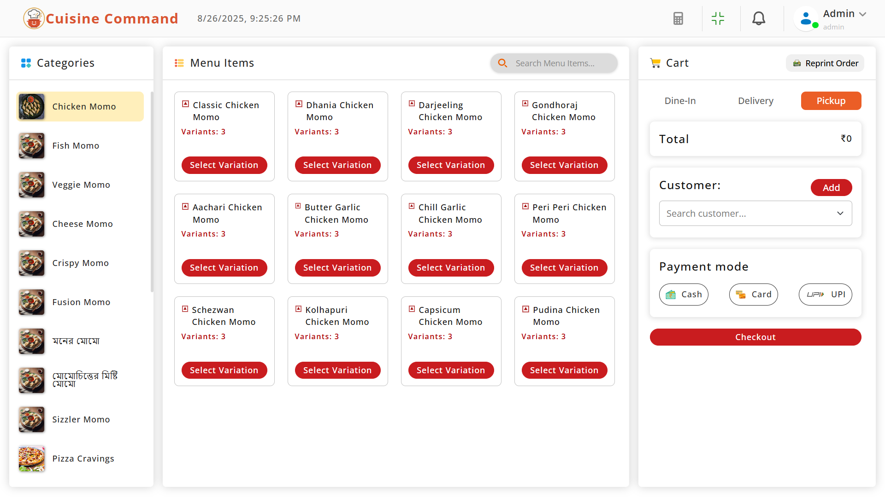
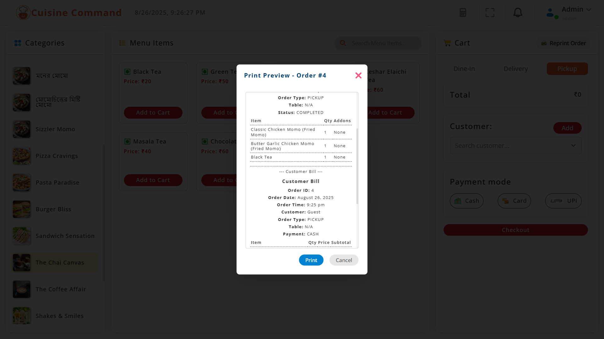
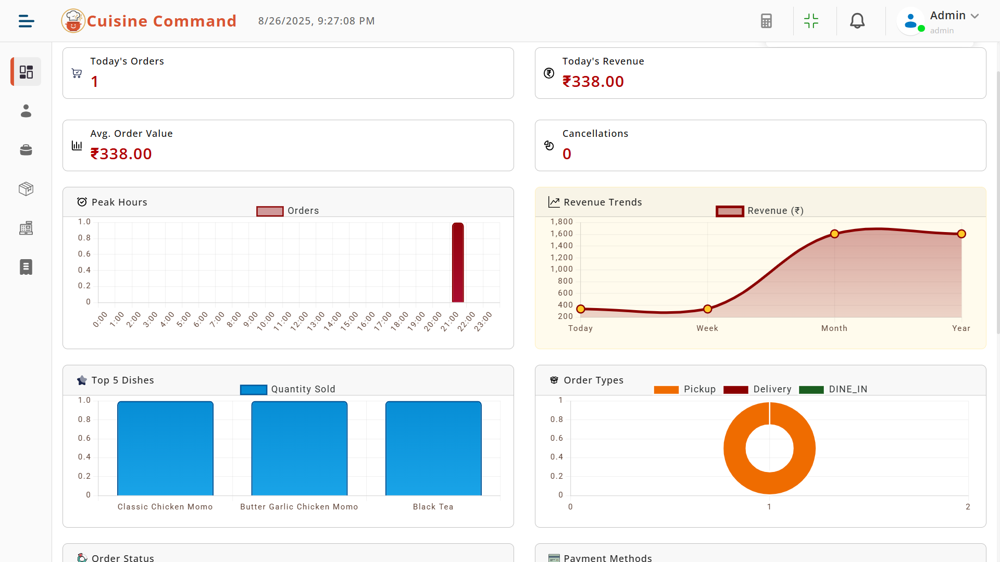
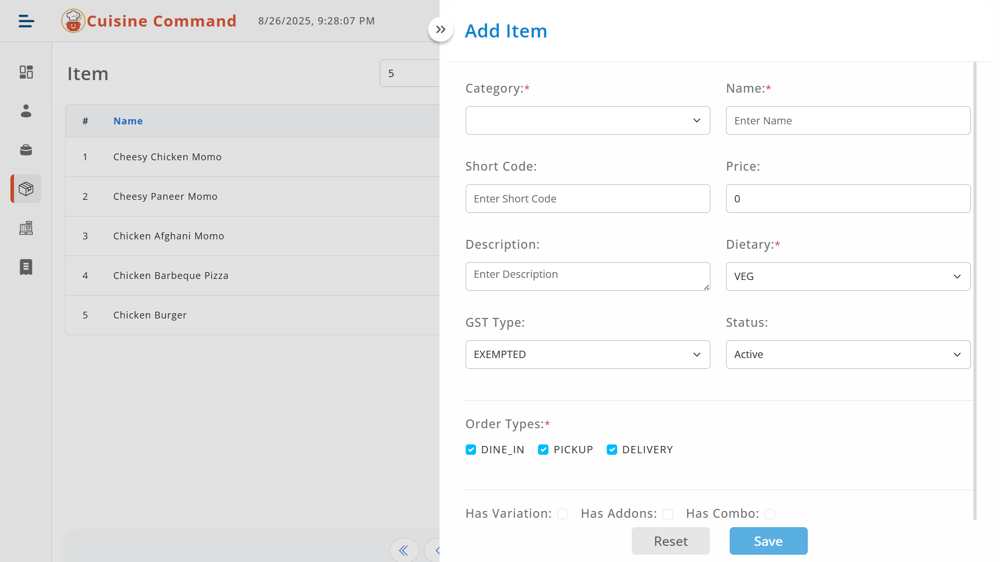
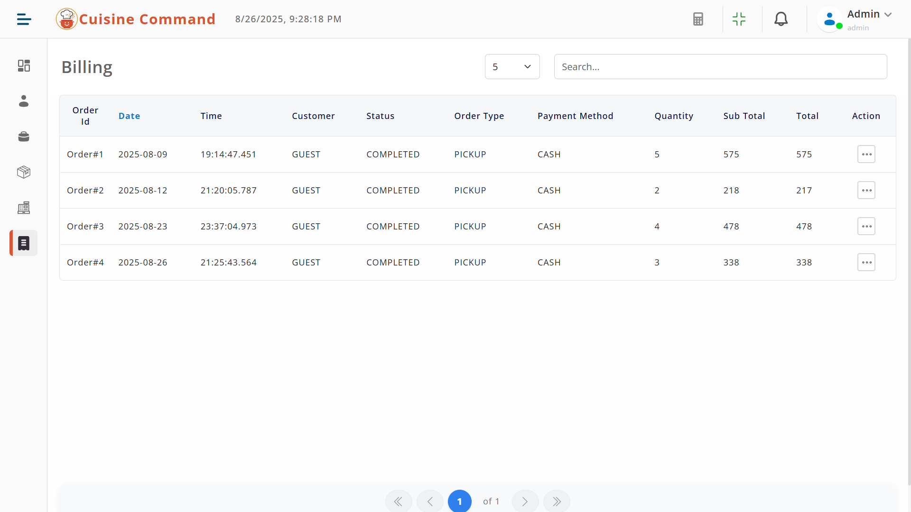

# cuisine-command 🍲

 

[](https://opensource.org/licenses/Apache-2.0) [](https://www.java.com/)  [](https://spring.io/projects/spring-boot) [](https://angular.io/)  

**Cuisine Command** (Your Kitchen Companion, Anytime, Anywhere!) is a comprehensive restaurant management application designed to streamline operations for restaurants. With a primary focus on **Point of Sale (POS)**, **billing**, and **stock management**, it provides an end-to-end solution for efficient restaurant handling. The backend is built with Spring Boot for robust API services, while the frontend uses Angular for a modern, responsive user interface.

This project includes features like user authentication, auditing, email notifications, file uploads, and more, making it a powerful tool for restaurant owners and staff.

---

## 🚀 Features

- **Point of Sale (POS) System** 📊: Quick order processing, table management, and real-time sales tracking.
- **Billing & Invoicing** 💳: Automated bill generation, payment integrations, and receipt printing.
- **Stock & Inventory Management** 🛒: Track ingredients, monitor stock levels, and receive low-stock alerts.
- **User Authentication & Authorization** 🔐: Secure JWT-based login with role-based access (e.g., admin, staff).
- **Auditing & Logging** 📝: Track changes with created/updated timestamps and user accountability.
- **Email Notifications** 📧: Asynchronous email sending for alerts, confirmations, and reports.
- **File Uploads** 📁: Secure image and document uploads for menus, profiles, etc.
- **API Documentation** 📚: Integrated OpenAPI/Swagger for easy API exploration.
- **Cross-Platform Support** 🌐: Backend supports Windows/Linux, frontend is web-based.

And much more! The app is extensible for additional modules like reporting, customer management, and integrations.

---

## 🛠️ Tech Stack

| Component     | Technology                  | Icon |
|---------------|-----------------------------|------|
| **Backend**  | Java, Spring Boot, JPA/Hibernate | ☕ |
| **Frontend** | Angular                     | 🅰️ |
| **Database** | MySQL/PostgreSQL (configurable) | 🗄️ |
| **Security** | JWT, Spring Security        | 🛡️ |
| **Others**   | Lombok, Swagger, JavaMail   | 🔧 |

---

## 📋 Prerequisites

- Java 17+ ☕
- Node.js & Angular CLI for frontend 🅰️
- MySQL or PostgreSQL database 🗄️
- Maven for building the backend 📦

---

## ⚙️ Installation

1. **Clone the Repository** 🖥️  
   ```
   git clone https://github.com/rajsekharacharya/cuisine-command.git
   ```

2. **Backend Setup** 🔙  
   - Navigate to the backend directory.  
   - Update `application.properties` with your database credentials and other configs (e.g., email sender).  
   - Build and run:  
     ```
     mvn clean install
     mvn spring-boot:run
     ```  
   The API will be available at `http://localhost:8080`.

3. **Frontend Setup** 🔝  
   - Navigate to the frontend directory (assuming Angular setup).  
   - Install dependencies:  
     ```
     npm install
     ```  
   - Run the app:  
     ```
     ng serve
     ```  
   The frontend will be available at `http://localhost:4200`.

4. **Database Setup** 🗃️  
   - Create a database named `cuisine-command`.  
   - Run the SQL scripts in `/resources/sql` (if available) or let JPA auto-create tables.

---

## 📖 Usage

- **API Endpoints** 🌐: Access Swagger UI at `/swagger-ui.html` for testing APIs.
- **Login** 🔑: Use `/api/auth/login` with credentials to get JWT.
- **POS Interface** 📱: Navigate to the POS dashboard in the frontend for order management.
- **Stock Management** 📦: Check inventory levels and update stock via dedicated screens.

For detailed API docs, refer to the OpenAPI configuration.

---

## 📸 Screenshots

Here are some glimpses of the application. (Replace placeholders with actual images.)

- **POS Interface**  
    
  *Quick order placement and table overview.*

- **Billing Screen**  
    
  *Automated invoice generation with payment options.*

- **Dashboard**  
    
  *Real-time Dashboard.*

- **Item Master**  
    
  *Manage menu items, prices, and categories.*

- **Order Panel**  
    
  *Order management.*

---

## 🤝 Contributing

Contributions are welcome! 🎉  
1. Fork the repo.  
2. Create a feature branch (`git checkout -b feature/YourFeature`).  
3. Commit changes (`git commit -m 'Add YourFeature'`).  
4. Push to the branch (`git push origin feature/YourFeature`).  
5. Open a Pull Request.

Please follow the code style and add tests for new features.

---

## 📄 License

This project is licensed under the Apache License 2.0 - see the [LICENSE](LICENSE) file for details.

---

## 📧 Contact
- **Author**: Rajsekhar Acharya
- **Email**: rajsekhar.acharya@gmail.com (placeholder)
- **GitHub**: [https://github.com/rajsekharacharya/cuisine-command](https://github.com/rajsekharacharya/cuisine-command)

⭐ Star the repo if you find it useful!